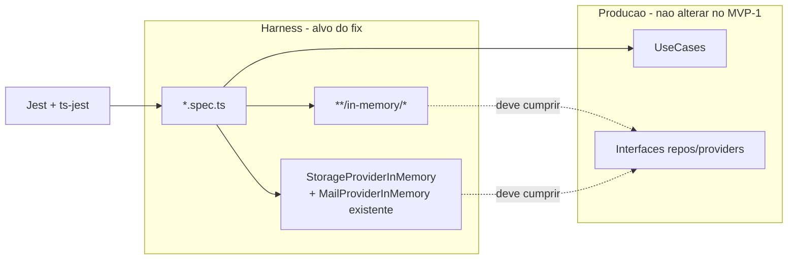

# Design — CORR-001 Testes automatizados Jest (harness)

**Tipo:** fix (arquitetura)  
**Branch:** `fix/testes-automatizados-jest`  
**Spec/CORR:** `docs/desenvolvimento/correcoes/2026-07-21-testes-automatizados-jest.md`  
**Status:** aprovado — pronto para desenvolvimento  
**Stack:** Node.js / TypeScript / Jest + ts-jest (`prepara-me-backend`)  
**Observabilidade (A-01):** sem `@clamed/logger` / `light-node-metrics`

---

## 1. Contexto e objetivos

**Problema:** 18 suites Jest falham em *load* (`Test suite failed to run`) por TypeScript; 93 testes que executam passam. Causa: harness (specs + in-memory) dessincronizado dos use cases/interfaces.

**Metas:**
- Todas as suites existentes **compilam e executam** sob `npm test`
- Zero mudanca de regra de negocio de producao (salvo bug real descoberto apos reativar suite — fora do MVP-1)
- Reusar padrao ja existente (`MailProviderInMemory`) para providers

**NFR:** N/A de performance/API; relevancia e confiabilidade da suite local/CI.

---

## 2. Recomendacao e alternativas

### Recomendada — Alinhar harness ao contrato atual (stubs + specs)

1. Completar `*RepositoryInMemory` que `implements` interface incompleta.
2. Criar `StorageProviderInMemory` espelhando `MailProviderInMemory`.
3. Atualizar `*.spec.ts` das 18 suites (ctors, imports DTO, args de `execute`).

**Por que:** ataca a causa raiz; barato; consistente com o repo; nao mascara tipagem.

### Alternativa descartada — Relaxar type-check do ts-jest

| Trade-off | |
|-----------|--|
| + | Diff menor, verde rapido |
| − | Erros viram runtime (`undefined`); esconde drift futuro |

**Descartada** (CORR §7.3).

---

## 3. Visao de sistema

Escopo **somente camada de teste** do backend. Sem mudanca de HTTP, TypeORM real ou frontend.



**Fronteiras:**
- Entra: `src/**/in-memory/**`, `src/**/*.spec.ts`, novo fake Storage
- Nao entra: controllers, migrations, platform, logger/metrics

---

## 4. Componentes e responsabilidades

| Componente | Faz | Nao faz |
|------------|-----|---------|
| `ProductsRepositoryInMemory` | Implementar metodos faltantes da `IProductsRepository` com stubs seguros | Persistencia real / SQL |
| `SpecialistScheduleRepositoryInMemory` | `findById`, `findToUser` | Integracao Google/Hangout |
| `SubscriptionPlanProductsRepositoryInMemory` | `delete(id)` | — |
| `StorageProviderInMemory` | `save` / `delete` no-op ou lista em memoria | S3/disco |
| Specs das 18 suites | Injetar deps corretas; DTO/params atuais | Novos cenarios de negocio (MVP-1) |
| Use cases de producao | **intocados** no MVP-1 | — |

---

## 5. Modelo de dados (alto nivel)

**N/A** — sem schema/DB. Consistencia e so tipagem TypeScript + arrays em memoria nos stubs.

Stubs sugeridos quando o metodo nao e exercitado pelo spec:
- `async findX(...): Promise<T | null>` → `return null` / `[]`
- ou `throw new Error("not implemented in memory")` se preferir falha explicita ao uso acidental

Preferencia MVP-1: **retorno vazio/`null`/`undefined` coerente** nos metodos so exigidos pela interface, e comportamento minimo nos caminhos que os specs ja exercitam.

---

## 6. Fluxos principais (da CORR)

Nao ha fluxo de request HTTP. Fluxo de verificacao:

1. Dev/CI → `npm test`
2. ts-jest compila `.spec.ts` → **deve passar** (hoje falha)
3. Jest executa `describe`/`it` → asserts existentes
4. V-01/V-02/V-03 da CORR

Familias de ajuste (ordem de implementacao):

| Familia | Suites (exemplos) | Acao |
|---------|-------------------|------|
| A — Products in-memory + onlyAdmin | list/create/remove/getProduct | Completar in-memory; passar `onlyAdmin` onde o tipo exige |
| B — Specialist + Storage | create/list/remove specialist* | Injeter `StorageProviderInMemory` em todo `new CreateSpecialistUseCase` |
| C — Schedule | create/list/remove schedule | Completar schedule in-memory; passar deps faltantes do ctor (ex. `userRepository`) |
| D — Accounts DTO/mail/survey | create/list UserProductAvailable; laborRisk; surveyFields | Corrigir import DTO; `MailProviderInMemory`; campo `surveyQuestion` |
| E — Company employee | removeCompanyEmployee | Passar 4 deps ao `CreateCompanyEmployeeUseCase` (igual ao spec que ja PASS) |
| F — Subscription plan product | createSubscriptionPlanProduct | Implementar `delete` no in-memory |

---

## 7. API / contratos

**N/A** HTTP. Contrato relevante e o das **interfaces TypeScript** ja existentes (`IProductsRepository`, `IStorageProvider`, ctors dos use cases).

Novo contrato de teste:

```ts
// StorageProvider/inMemory/StorageProviderInMemory.ts
class StorageProviderInMemory implements IStorageProvider {
  async save(file: string, folder: string): Promise<string> { /* retorna file ou path fake */ }
  async delete(file: string, folder: string): Promise<void> { /* no-op / remove da lista */ }
}
```

---

## 8. Infra

**N/A** Docker/env novos. Continua:

- `npm test` → `cross-env NODE_ENV=test` + Jest `--runInBand`
- Sem mudanca de `.env` para este fix

---

## 9. Estrutura de pastas / branch

```
prepara-me-backend/
  docs/desenvolvimento/correcoes/2026-07-21-testes-automatizados-jest.md
  docs/desenvolvimento/correcoes/2026-07-21-testes-automatizados-jest-design.md  ← este
  src/shared/container/providers/StorageProvider/inMemory/StorageProviderInMemory.ts  ← novo
  src/modules/**/repositories/in-memory/*.ts  ← completar
  src/modules/**/useCases/**/*.spec.ts       ← alinhar
```

**Branch:** `fix/testes-automatizados-jest` (ja criada a partir de `master`).

---

## 10. MVPs possíveis

### MVP-1 (recomendado — menor valor util)

Fazer as 18 suites **carregarem e rodarem**; corrigir apenas asserts que quebrem por stub incompleto no caminho ja coberto. Meta: `Test Suites` sem `failed to run` por TS do harness.

### Incremento 2 (opcional)

Fortalecer stubs in-memory com comportamento realista; cobrir metodos novos com testes dedicados; gate CI explicito contra `Test suite failed to run`.

---

## 11. Riscos e decisoes abertas

| Risco | Mitigacao |
|-------|-----------|
| Apos compilar, asserts falham | Segunda passagem: ajustar expectativa do teste **ou** registrar bug de produto separado |
| Stub generico demais | Preferir retorno vazio; se spec depende do metodo, implementar o minimo |
| Diff grande | Commits por familia A–F se o usuario pedir; senao um PR coerente |

**Duvidas a esclarecer:** nenhuma bloqueante. PowerBuilder: N/A.

---

## 12. Plano de implementacao

Ordem sugerida (skill **`backend`** / manutencao de testes no mesmo repo; sem `frontend`):

1. Criar `StorageProviderInMemory`
2. Completar in-memory (Products, SpecialistSchedule, SubscriptionPlanProducts)
3. Patch specs familia B → C → E → D → A → F (ou por ordem de falha do Jest)
4. Rodar `npm test -- --coverage=false` (V-01)
5. Ajustar asserts residuais
6. Fases seguintes do orquestrador: `review` → `teste-regra-negocio` (V-xx da CORR) → `teste-automatizado` → `documentacao`

**Fora:** mudanca de use case de producao no MVP-1; logger/metrics.
