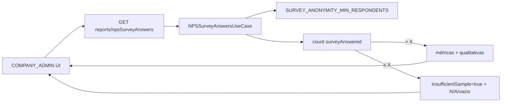

# System Design — Anonimato RH (limiar configurável + `insufficientSample`)

**Spec:** [2026-07-21-rh-anonimato-limite-amostra.md](./2026-07-21-rh-anonimato-limite-amostra.md) (aprovada)  
**Branches:**  
- `prepara-me-backend`: `feat/rh-anonimato-limite-amostra`  
- `preparame-platform`: `feat/rh-anonimato-limite-amostra` (criar a partir da base atual do front / `main` ou branch RH vigente)  
**Status:** aprovado (alternativa A) · entrega documentada / SPEC verificado  
**Data:** 2026-07-21  
**Skills:** `backend` → `frontend` → `review` → testes → `documentacao`

---

## 1. Contexto e objetivos

Garantir anonimato nas consultas RH (Painel, quantitativa, qualitativa) quando a amostra filtrada de respondentes for **≤ X** (env, default 5). Remover bypass de **COMPANY_ADMIN**. Renomear contrato **`lessThanFive` → `insufficientSample`**. Sem logger/metrics Clamed.

**NFR:** enforcement na API; front e back sobem juntos; sem alias legado.

## 2. Recomendacao e alternativas

### Recomendada — A: limiar central em `NPSSurveyAnswersUseCase` + rename no platform

| Prós | Contras |
|------|---------|
| Um ponto de verdade (mesmo endpoint das 3 telas) | Breaking rename exige PR coordenado |
| Reusa fluxo `N/A` / UI `insufficient` já existente | Script de teste RH precisa atualizar expectativas |
| Env simples | — |

**Mecânica:**
1. Helper `getAnonymityMinRespondents(): number` lê `SURVEY_ANONYMITY_MIN_RESPONDENTS`, parse int, fallback **5** se NaN/`< 0`/ausente.
2. Renomear método interno `shouldCheckSurveyLimit` → `isSampleInsufficient` (ou `isBelowAnonymityThreshold`): retorna `true` quando deve omitir dados.
3. Lógica de papéis:
   - `ADMIN` → nunca insuficiente por limiar (MVP).
   - `COMPANY_ADMIN` → **sempre** avalia contagem (`surveyAnswered` ≤ X); **não** bypass.
   - Demais papéis → mantém avaliação por contagem.
4. `EXCEPTION_COMPANY_IDS`: **não isenta COMPANY_ADMIN**. Manter só para papéis que não sejam COMPANY_ADMIN (legado), ou efetivamente só impacta não-RH. Decisão: **Q-02 = manter lista, mas ignorá-la quando `roleUser === COMPANY_ADMIN`**.
5. Resposta JSON: `insufficientSample: boolean` (remover `lessThanFive`).
6. Frontend: mapear `report.insufficientSample`; renomear data/props `lessThanFive` → `insufficientSample` (componentes de chart podem aceitar prop `insufficient` já usado em rows).

### Alternativa B — middleware genérico em todas as rotas de report

Descartada no MVP: só este use case alimenta as 3 telas; over-engineering.

## 3. Visao de sistema



**Fronteiras:** backend Node (`prepara-me-backend`); frontend Quasar (`preparame-platform`). Sem mudança de schema DB.

## 4. Componentes e responsabilidades

| Peça | Faz | Não faz |
|------|-----|---------|
| `NPSSurveyAnswersUseCase` | Limiar, papéis, rename flag, omitir getters | UI |
| `.env.exemple` | Documentar `SURVEY_ANONYMITY_MIN_RESPONDENTS=5` | — |
| `scripts/test-dashboard-rh-data.js` | Esperar `insufficientSample` e **falhar** se COMPANY_ADMIN liberar amostra ≤ X com filtro estreito | Bypass antigo |
| `DashBoardAnswers.vue` + `rhMetricDisplay.js` + cards/charts | Consumir `insufficientSample` | Recalcular limiar no client |
| Docs produto RH (curto) | Mencionar anonimato / amostra mínima | — |

## 5. Modelo de dados

N/A schema. Contrato de resposta (trecho):

```json
{
  "insufficientSample": true,
  "nps": "N/A",
  "companyQuestions": [],
  "general": { "...": "benchmark inalterado se já existir" }
}
```

**A-02:** manter `general` como hoje (média ampla); o risco de inferência cruzada é aceito no MVP se o subset filtrado estiver omitido — documentado. Se no futuro `general` vazar contexto, recortar em incremento.

## 6. Fluxos principais

1. RH aplica filtros → `filterCrud(..., "reports/NPSSurveyAnswers")`.
2. Use case monta `users` filtrados → conta `surveyAnswered`.
3. Se COMPANY_ADMIN e count ≤ X → `insufficientSample=true`; getters retornam `N/A`/vazio; `companyQuestions` vazio/omitido.
4. Se count > X → dados normais; `insufficientSample=false`.
5. ADMIN → dados mesmo com count ≤ X; `insufficientSample=false`.

## 7. API / contratos

- Rota existente: `reports` → `/npsSurveyAnswers` (sem mudança de path).
- **Breaking:** campo `lessThanFive` removido; usar `insufficientSample`.
- Auth: mesmo middleware atual (perfil no token/user).

## 8. Infra

- Env: `SURVEY_ANONYMITY_MIN_RESPONDENTS` (default 5).
- Docker Compose: acrescentar no `.env` / compose do backend se listar envs explicitamente.
- Restart do container API após mudar X.

## 9. Estrutura / branches

```
prepara-me-backend/feat/rh-anonimato-limite-amostra
  src/reports/NPSSurveyAnswers/useCase/NPSSurveyAnswersUseCase.ts
  .env.exemple
  scripts/test-dashboard-rh-data.js
  docs/desenvolvimento/especificacoes/...

preparame-platform/feat/rh-anonimato-limite-amostra
  DashBoardAnswers.vue, rhMetricDisplay.js, RowChart*.vue, UiMetricCard.vue, …
  docs produto + CHANGELOG Unreleased
```

## 10. MVPs

- **MVP-1:** limiar COMPANY_ADMIN + env + rename `insufficientSample` + script/docs.
- **Incremento:** limiar por empresa; aplicar a ADMIN; revisar `general`; remover `EXCEPTION_COMPANY_IDS`.

## 11. Riscos e decisoes

| Risco | Mitigação |
|-------|-----------|
| Front antigo em cache com `lessThanFive` | Deploy coordenado; val VAL-06 |
| Script de teste ainda exige bypass RH | Reescrever asserções (VAL-01) |
| EXCEPTION_COMPANY_IDS enfraquece anonimato do RH | **Ignorar lista para COMPANY_ADMIN** (Q-02 resolvida assim) |
| Props Vue `lessThanFive` espalhadas | Rename sistemático + grep CI mental |

**PowerBuilder:** N/A.

## 12. Plano de implementacao

1. **`backend`:** helper env; `isSampleInsufficient`; COMPANY_ADMIN sem bypass; EXCEPTION ignorada p/ RH; JSON `insufficientSample`; `.env.exemple`; script teste.
2. **`frontend`:** branch espelho; trocar leituras/props; smoke nas 3 telas.
3. Docs: SPEC status; CHANGELOG platform/backend se houver; nota anonimato no dashboard RH.
4. Orquestrador: `review` → VAL-01…06 → suite (N/A ou specs backend existentes) → `documentacao` → DoD.
