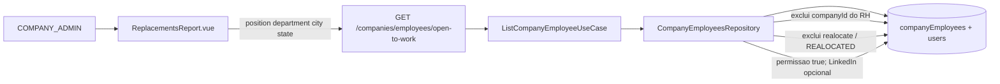

# System Design — Melhorias Open to Work (Company Admin)

**Spec:** [2026-07-21-rh-open-to-work-melhorias.md](./2026-07-21-rh-open-to-work-melhorias.md) (aprovada v0.2)  
**Branch:** `feat/rh-open-to-work-melhorias` (backend + platform)  
**Status:** aprovado — pronto para desenvolvimento  
**Data:** 2026-07-21  
**Observabilidade (A-01):** sem `@clamed/logger` / `light-node-metrics`  
**Skills na implementacao:** `backend` → `frontend` → docs

---

## 1. Contexto e objetivos

Ajustar a consulta **Contrate Open to Work** (`/replacementsReport`): elegibilidade correta (permissao default permitir; LinkedIn opcional; sem realocados; **outras empresas** para COMPANY_ADMIN), filtros cargo/area/cidade/estado, remocao de empresa/data da lista OTW, e mensagem ao clicar LinkedIn ausente.

**NFR:** COMPANY_ADMIN nunca ve da propria empresa (RNF-01); mensagem unica PT-BR; sem novos pacotes de observabilidade.

## 2. Recomendacao e alternativas

### Recomendada — A: filtro OTW no repositorio + UI com filtros proprios

1. **Backend:** estender `openToWork` em `CompanyEmployeesRepository.find` + `handleOpenToWork` / use case com: remove exigencia de URL; exclui `realocate`; left-join user e exclui `REALOCATED` so se user existir; para COMPANY_ADMIN exclui `companyId` do usuario; aceita `position`, `department`, `city`, `state` (ILIKE parcial ou igualdade — preferencia ILIKE `%x%` para UX de busca).
2. **Frontend:** bloco de filtros **separado** para OTW (cargo/area/cidade/estado); remover empresa da lista OTW e do filtro OTW; datas ficam so no bloco de metricas de recolocacao (A-04); clique LinkedIn sem URL → `Notify`/`Dialog` com texto da spec.

| Pros | Contras |
|------|---------|
| Ataca causa (API ainda exige URL e nao filtra realocado/outras empresas) | Touch em controller + repo + Vue |
| Alinha RN-03/07 sem exigir user | — |

### Alternativa B — so frontend (filtrar client-side)

Descartada: vazamento de dados da propria empresa e lista incompleta (API nao devolve sem LinkedIn).

## 3. Visao de sistema



**Fronteiras:** backend Node + frontend Quasar. Sem workers/Docker novos.

## 4. Componentes e responsabilidades

| Peca | Faz | Nao faz |
|------|-----|---------|
| `ListCompanyEmployeeController.handleOpenToWork` | Resolve user; se COMPANY_ADMIN, passa `excludeCompanyId`; query filters OTW | Metricas de recolocacao |
| `ListCompanyEmployeeUseCase` | Encaminha novos filtros + flag openToWork | Regra SQL |
| `CompanyEmployeesRepository.find` (ramo `openToWork`) | WHERE permissao; NOT realocate; (user null OR not REALOCATED); linkedin opcional; excludeCompanyId; position/department/city/state | Default de create employee |
| Create/Update LinkedIn / map DTO | Manter default `true` (RN-01); sem migration em massa (A-02) | Overwrite de quem optou false |
| `ReplacementsReport.vue` | Filtros OTW proprios; colunas sem empresa; Notify no LinkedIn vazio; datas so metricas | Alterar formula dos cards de metricas |
| Docs produto RH | Atualizar mapa/painel se citarem filtros OTW | — |

## 5. Modelo de dados (alto nivel)

Sem migration nova. Campos existentes:

| Campo | Uso OTW |
|-------|---------|
| `showLinkedinInRelocationProgram` | = true (null tratado como true no map; query usa true) |
| `linkedinUrl` | opcional na listagem |
| `realocate` | deve ser false / not true |
| `users.realocated` | se join user e = REALOCATED → fora |
| `position`, `department`, `city`, `state` | filtros |
| `companyId` | COMPANY_ADMIN: `<>` empresa do usuario |

Consistencia: leitura (lista). Escrita da permissao ja default true.

## 6. Fluxos principais (da especificacao)

### UC-01 — Consultar OTW

1. RH abre `/replacementsReport`
2. Front chama API OTW (sem companyId; com filtros OTW se preenchidos)
3. Backend identifica COMPANY_ADMIN → `excludeCompanyId = user.companyId`
4. Repo aplica elegibilidade + filtros
5. UI renderiza; clique LinkedIn → URL ou mensagem

### ADMIN global (Q-01)

MVP: se `ADMIN`, **nao** aplica `excludeCompanyId` (ve todas as empresas), ainda sem coluna Empresa na UI. Confirmado por A/Q residual — default do design.

## 7. API / contratos

`GET /companies/employees/open-to-work`

| Query | Tipo | Obrigatoriedade |
|-------|------|-----------------|
| `position` | string | opcional |
| `department` | string | opcional |
| `city` | string | opcional |
| `state` | string | opcional |
| `companyId` / `companyName` | — | **removidos do contrato OTW** no front; backend ignora para COMPANY_ADMIN (sempre exclude) |

Auth: JWT existente. COMPANY_ADMIN sem `companyId` no user → 400 (como list employees).

Resposta: array DTO atual (sem exigir `linkedinUrl`).

## 8. Infra

N/A — sem Compose/env novos.

## 9. Estrutura de pastas / branch

```
prepara-me-backend/
  docs/.../2026-07-21-rh-open-to-work-melhorias.md
  docs/.../2026-07-21-rh-open-to-work-melhorias-design.md
  src/modules/company/useCases/listCompanyEmployee/*
  src/modules/company/infra/typeorm/repositories/CompanyEmployeesRepository.ts

preparame-platform/
  docs/.../2026-07-21-rh-open-to-work-melhorias.md (+ design)
  src/components/platform/replacementsReport/ReplacementsReport.vue
  docs produto RH (painel / mapa) se necessario
```

Branch ja aberta: `feat/rh-open-to-work-melhorias`.

## 10. MVPs possiveis

### MVP-1 (recomendado)

Elegibilidade (RN-01..04, RN-07) + filtros + UI mensagem + remocao empresa/data da OTW.

### Incremento 2

Backfill opcional de permissao; testes automatizados dedicados do repo OTW; ADMIN com filtro empresa interno.

## 11. Riscos e decisoes abertas

| Risco | Mitigacao |
|-------|-----------|
| Join user quebra quem nao tem user | LEFT JOIN; so exclui se user.realocated = REALOCATED |
| ILIKE em campos vazios | So aplica WHERE se query param nao vazio |
| Metricas ainda com filtro empresa | Remover empresa do card de filtros da pagina no fluxo RH; datas so metricas (A-04) |
| Q-01 ADMIN | Default: ve todas; documentado acima |

**Duvidas:** PowerBuilder N/A.

## 12. Plano de implementacao

1. **backend:** repo `openToWork` + controller `excludeCompanyId` + filtros  
2. **frontend:** `ReplacementsReport.vue` filtros/colunas/Notify  
3. Smoke manual VAL-01..07  
4. Fases: `review` → `teste-regra-negocio` → `teste-automatizado` → `documentacao`
