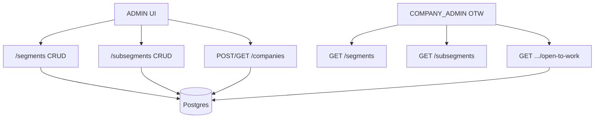

# System Design — Segmento / Subsegmento + Empresa + filtros/colunas OTW

**Spec:** [2026-07-22-rh-segmento-subsegmento.md](./2026-07-22-rh-segmento-subsegmento.md) (aprovada v0.2)  
**Branches:**  
- `prepara-me-backend`: `feat/rh-segmento-subsegmento`  
- `preparame-platform`: `feat/rh-segmento-subsegmento`  
**Status:** aprovado  
**Data:** 2026-07-22  
**Skills pos-aprovacao:** `backend` → `frontend` → `review` → `teste-regra-negocio` → `teste-automatizado` → `documentacao`

---

## 1. Contexto e objetivos

Entregar cadastros Admin de **Segmento** e **Subsegmento** (hierarquia), campos **opcionais** na **Empresa**, e no **Open to Work** (COMPANY_ADMIN): filtros **dropdown** + colunas Segmento/Subsegmento vindos da **empresa do colaborador**, **sem** exibir empresa.

**NFR:** mutacoes so ADMIN; listagens read-only para dropdown OTW ao COMPANY_ADMIN; sem `@clamed/logger` / `light-node-metrics`.

## 2. Recomendacao e alternativas

### Recomendada — A: modulos CRUD TypeORM espelhando `subscriptionPlans` + FKs em `companies` + extensao OTW

| Pros | Contras |
|------|---------|
| Padrao ja usado no monorepo (entity/repo/use case/routes + Query/Register CRUD) | Dois CRUDs + migracao + OTW = varios arquivos |
| Hierarquia clara (subsegmento → segmento) atende A-01 e cascade de filtros | Remocao com checagem de vinculos precisa queries extras |
| OTW ja faz `leftJoin` em `ce.company` — filtro/coluna e extensao natural | Resposta OTW hoje embute `company` completo; precisa map dedicado |

**Mecanica resumida:**
1. Tabelas `segments` e `subsegments` (FK `segmentId` em subsegments).
2. Colunas nullable `segmentId` / `subsegmentId` em `companies`.
3. Rotas `/segments` e `/subsegments` com `ensuredAuthenticated` + `ensureAdmin` no CRUD; GET listagem tambem liberada a autenticados COMPANY_ADMIN (ou rota GET sem ensureAdmin, mutacoes com ensureAdmin) — ver §7.
4. OTW: query params `segmentId` / `subsegmentId`; select de nomes; DTO **sem** `company.name`/`company.id`.
5. Front: dois CRUDs Admin + DialogSelect na empresa + dropdowns/colunas no `ReplacementsReport`.

### Alternativa B — strings livres na empresa (sem cadastro)

Descartada: SPEC exige CRUD Admin e dropdowns a partir de cadastros.

### Alternativa C — um unico CRUD “classificacao” com tipo

Descartada no MVP: SPEC pede cadastros **separados**; hierarquia ja resolve o vinculo.

## 3. Visao de sistema



**Fronteiras:** `prepara-me-backend` (Node/Express/TypeORM) + `preparame-platform` (Vue/Quasar). Sem workers externos.

## 4. Componentes e responsabilidades

| Peca | Faz | Nao faz |
|------|-----|---------|
| Modulo `segment` (entity/repo/use cases/routes) | CRUD Segmento; unicidade nome; bloqueio delete com filhos/empresas | UI |
| Modulo `subsegment` | CRUD Subsegmento; FK segmento; unicidade (segmentId, nome); bloqueio delete com empresas | UI |
| `Company` + CreateCompany | Persistir FKs opcionais; validar RN-05 no use case | Cadastro de segmentos |
| `CompanyEmployeesRepository.find` (OTW) | Filtrar por `c.segmentId`/`c.subsegmentId`; carregar nomes | Expor nome da empresa |
| Map/DTO OTW | `segmentName`, `subsegmentName` (ou nested minimo); omitir company id/name | Alterar elegibilidade OTW alem do necessario |
| FE `*Segment*Crud` / `*Subsegment*Crud` | Telas Admin padrao CrudQuery/CrudRegister | — |
| FE `CompaniesRegisterCrud` | DialogSelect segmento/subsegmento + cascade | — |
| FE `ReplacementsReport` | Dropdowns + colunas; remover coluna Empresa se ainda existir | Cadastro Admin |

## 5. Modelo de dados (alto nivel)

**DB:** Postgres (TypeORM migrations).

```text
segments
  id uuid PK
  name varchar NOT NULL  -- unique lower(name)

subsegments
  id uuid PK
  name varchar NOT NULL
  segmentId uuid NOT NULL FK → segments.id
  UNIQUE (segmentId, lower(name))

companies  (alter)
  segmentId uuid NULL FK → segments.id
  subsegmentId uuid NULL FK → subsegments.id
```

**Consistencia:**
- App valida RN-05 no create/update de company (subsegment.segmentId === company.segmentId; se so sub → preencher segment do pai).
- Delete segmento: falha se existir subsegment ou company com `segmentId`.
- Delete subsegmento: falha se existir company com `subsegmentId`.
- FKs ON DELETE RESTRICT (ou equivalente via checagem AppError antes do delete).

## 6. Fluxos principais (da especificacao)

1. **UC-01 Cadastro:** ADMIN → POST `/segments` / `/subsegments` → AppError se duplicata → listagem.
2. **UC-02 Empresa:** ADMIN → POST `/companies` com `segmentId`/`subsegmentId` opcionais → validacao RN-05 → save upsert.
3. **UC-03 OTW:** COMPANY_ADMIN → GET dropdowns → GET open-to-work com `segmentId`/`subsegmentId` → join company → filtro AND → DTO com nomes, sem empresa.

## 7. API / contratos

### Segmentos

| Metodo | Path | Auth |
|--------|------|------|
| GET | `/segments` | autenticado (ADMIN + COMPANY_ADMIN) |
| GET | `/segments/:id` | autenticado |
| POST | `/segments` | autenticado + **ensureAdmin** |
| DELETE | `/segments/:id` | autenticado + **ensureAdmin** |

Body POST (upsert): `{ id?, name }`

### Subsegmentos

| Metodo | Path | Auth |
|--------|------|------|
| GET | `/subsegments` | autenticado; query opcional `segmentId` (cascade UI) |
| GET | `/subsegments/:id` | autenticado |
| POST | `/subsegments` | autenticado + **ensureAdmin** |
| DELETE | `/subsegments/:id` | autenticado + **ensureAdmin** |

Body POST: `{ id?, name, segmentId }`

### Empresa (existente)

- POST `/companies`: aceitar `segmentId`, `subsegmentId` (nullable / omitidos).
- GET list/by id: incluir FKs e, se util ao form, nomes via join (ou front resolve via DialogSelect).

### Open to Work (existente)

`GET /companies/employees/open-to-work`

**Novos query params (opcionais):** `segmentId`, `subsegmentId`  
**Mantidos:** filtros textuais ja existentes (position, department, city, state, etc. conforme branch).

**Resposta (item) — contrato OTW:**

```json
{
  "id": "...",
  "name": "...",
  "position": "...",
  "department": "...",
  "city": "...",
  "state": "...",
  "linkedinUrl": "...",
  "segmentName": "Varejo",
  "subsegmentName": "Farmaceutico"
}
```

- **Nao** incluir `company`, `companyId`, `company.name` no payload OTW (RN-14). Preferir map dedicado `toOpenToWorkDTO` para nao quebrar outros consumers de `CompanyEmployeeMap` se houver.

## 8. Infra

- Sem novos servicos Compose; mesma Postgres.
- Sem novas env vars.
- Migracoes locais: `npm`/script de migration do projeto (padrao existente).

## 9. Estrutura de pastas / branch

**Backend (espelho subscriptionPlans):**
- `src/modules/segments/...` (ou `company` sibling `segments` / `subsegments`)
- routes em `shared/infra/http/routes/segments.routes.ts` + `subsegments.routes.ts`
- migrations `CreateSegments…`, `CreateSubsegments…`, `AddSegmentFieldsToCompanies…`

**Frontend:**
- `src/components/platform/segmentsCrud/` + `subsegmentsCrud/`
- routes `segments.route.js`, `subsegments.route.js` com `userTypes: ['ADMIN']`
- `menuConfig.js` Cadastros: Segmentos, Subsegmentos
- `companiesCrud/CompaniesRegisterCrud.vue` — DialogSelects
- `replacementsReport/ReplacementsReport.vue` — dropdowns + colunas; remover Empresa

**Branch:** ja `feat/rh-segmento-subsegmento` nos dois repos.

## 10. MVPs possiveis

- **MVP-1 (este entrega):** CRUD + FKs empresa + OTW filtros dropdown + colunas + sem empresa na lista.
- **Proximo:** seed inicial; filtro OTW por nome; auditoria de mudanca de classificacao.

## 11. Riscos e decisoes abertas

| Risco / decisao | Mitigacao |
|-----------------|-----------|
| Payload OTW hoje expoe `company` | Map dedicado OTW; testes manuais VAL-11 |
| Base platform ainda mostra coluna Empresa + filtro companyId | Remover na mesma entrega (alinhado RN-14 / fora de escopo mostrar empresa) |
| `GET /companies` sem ensureAdmin legado | Nao expandir problema; Segment CRUD com ensureAdmin correto |
| Unicidade case-insensitive | Unique index em `lower(name)` ou checagem no use case (como plans) |
| Q-01 hierarquia | SPEC A-01 assumida; design A |

**Duvidas:** nenhuma bloqueante alem do ja assumido na SPEC.

## 12. Plano de implementacao

1. **backend:** migrations + entities Segment/Subsegment; FKs Company; repos/use cases/routes; validacoes RN-02/03/05/06/07; OTW query + DTO. Skill: `backend`.
2. **frontend:** CRUDs Admin + menu + Company DialogSelect cascade; OTW dropdowns cascade + colunas; remover Empresa. Skill: `frontend`.
3. **review** → **teste-regra-negocio** (VAL-01…12) → **teste-automatizado** (suite geral backend) → **documentacao**.

Ordem sugerida de commits logicos: schema → API segmentos → company → OTW API → FE cadastros → FE empresa → FE OTW.
